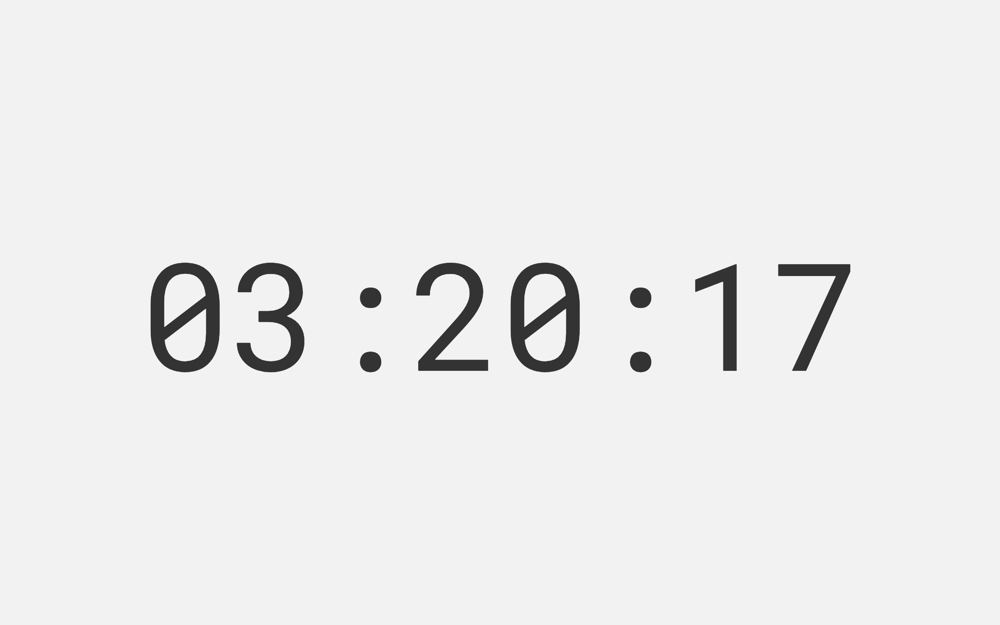

# CleanTimer

[CleanTimer.io](https://cleantimer.io) - A Clean and Simple Timer App

[](https://www.codefactor.io/repository/github/isnit0/cleantimer)



## Requirements
- *nix Operating System
- NodeJS

## Building
```bash
> npm i
> ./build.sh
```

## Development
```bash
> brew install fswatch && npm i -g http-server typescript
> ./watch.sh & http-server
```

# License
[MIT](./LICENSE)
